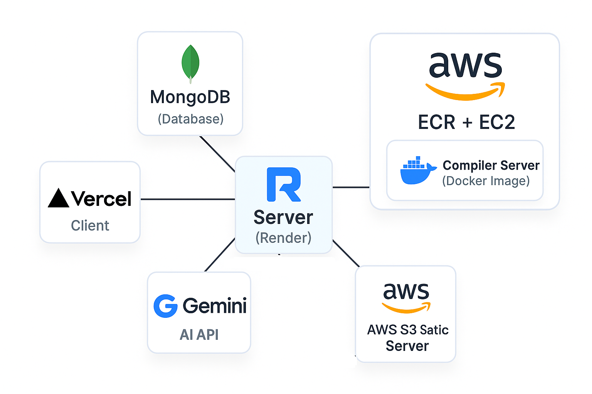
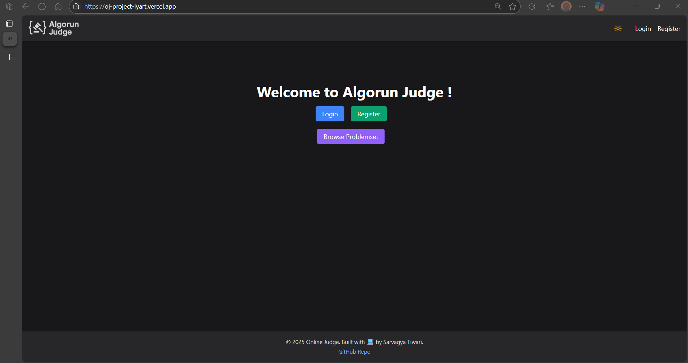
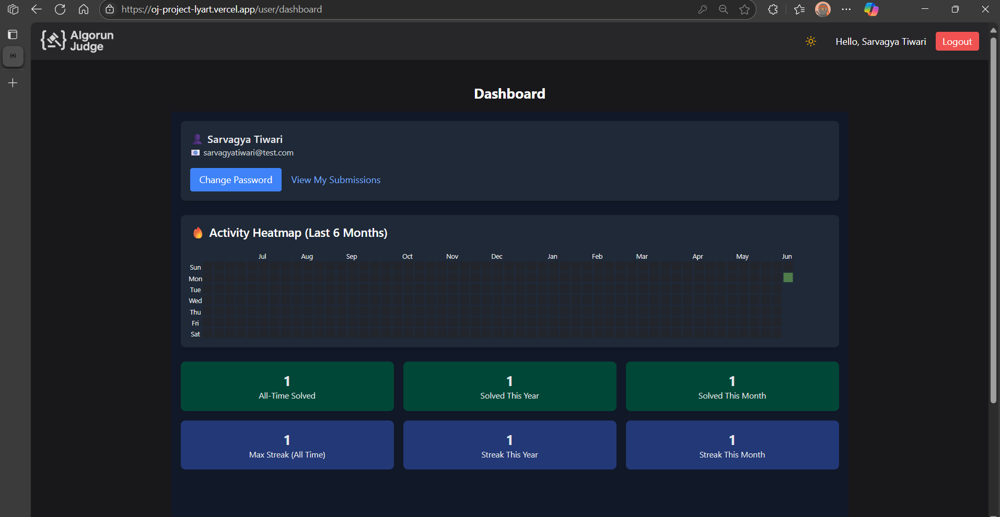
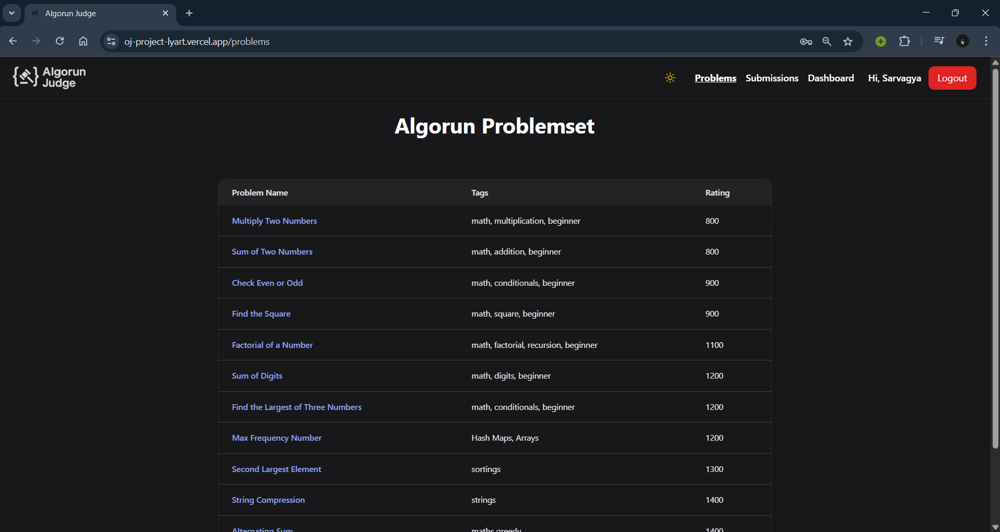
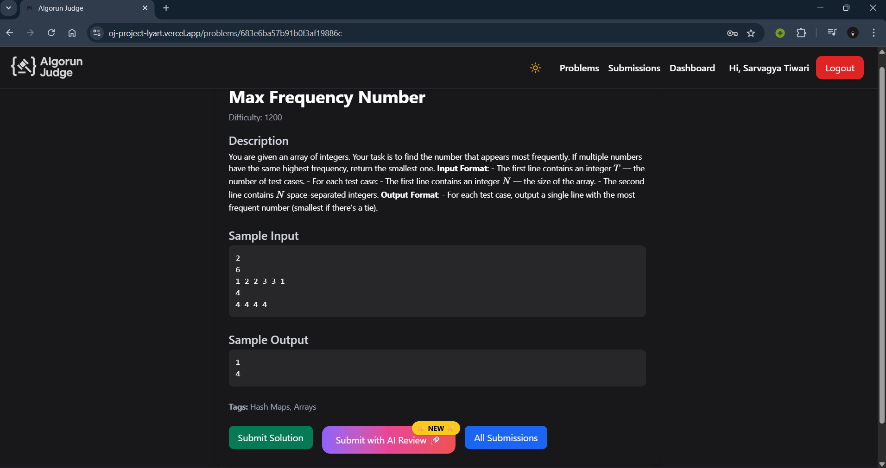
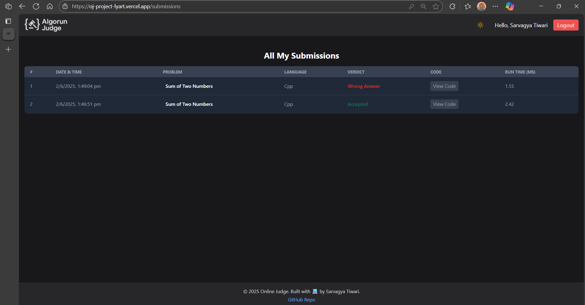
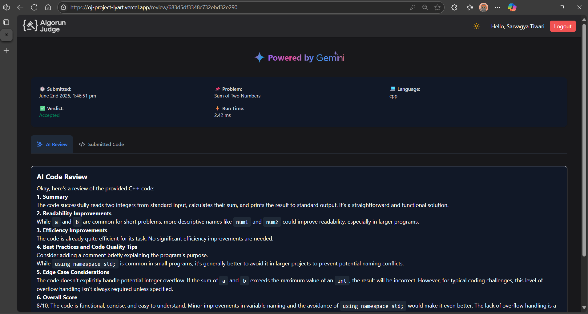

# 🧠 Algorun Judge

A modern, full-featured online judge built with the **MERN stack**, designed for solving coding problems, managing submissions, and receiving AI-powered code reviews. This project includes real-time code execution in multiple languages, problem management for admins, and user dashboards with analytics and streak tracking.


---

## 🌟 Live Demo

🚀 **Check it out here:** [https://oj-project-lyart.vercel.app/](https://oj-project-lyart.vercel.app/)

---

## 🏗 System Architecture Diagram



---

## 📌 Features

✅ Solve coding problems in C++, Python, and Java  
🧪 Automatic code evaluation with hidden test cases  
🧠 AI Review system (powered by Gemini API)  
🧑‍🏫 Admin dashboard to add/edit/delete problems  
🗃 User submission history with verdicts and timestamps  
📊 Analytics dashboard with streaks and heatmap  
🔐 JWT authentication with HTTP-only cookies  
🐳 Dockerized compiler microservice  
📁 File-based test case management

---

## 🧰 Tech Stack

### Frontend:
- React (Vite)  
- Tailwind CSS  
- Flowbite React (Tabs, Cards, Components)

### Backend:
- Node.js & Express  
- MongoDB Atlas  
- AWS S3 (for static storage of test case files)  
- Multer (for file handling)  
- JWT & bcrypt (for authentication)

### Compiler Service:
- Node.js (`child_process`)  
- Docker (isolated code execution)  
- Deployed on AWS EC2, with Docker image pushed to AWS ECR

### AI Integration:
- Gemini API (Google Generative AI)

---

## 🏗️ System Architecture

```
[Frontend - React]
      |
      v
[Main Backend - Node.js + Express]
      |
      ├── MongoDB Atlas (users, problems, submissions)
      ├── AWS S3 (static storage: test case files)
      └── Compiler Server (code execution)
              |
              └──  Docker container deployed on AWS EC2
                    (Docker image pulled from AWS ECR)
              
```

---

## 📁 Folder Structure

```
/client               → React app
/server
  ├── config                 → Configuration files (AWS, DB, app config)
  ├── controllers            → Route logic (auth, problems, submissions, S3, Gemini API)
  ├── gemini                 → Gemini API integration modules
  ├── middleware             → Auth checks, upload handling
  ├── models                 → Mongoose schemas and models
  ├── routes                 → Express routes (auth, problems, submissions, Gemini)
  ├── uploads                → Local storage for uploaded files (temp, before using S3)
  ├── .env.sample            → Example environment variables
/compiler-server
  ├── code_files → Temporary code files for execution
  ├── executables → Compiled binaries
  ├── cron → Scheduled cleanup or background tasks
  ├── routes → Express routes (e.g., runRoute.js)
  ├── utils → Helper modules (e.g., executeCpp.js, executeJava.js, cleanup.js)
  ├── Dockerfile → Docker build instructions
  ├── server.js → Entry point for compiler server
```

---

## 🚀 Getting Started

### 1️⃣ Clone the Repo

```bash
git clone https://github.com/sarvagya1201/OJ-Project.git
cd OJ-Project
```

### 2️⃣ Backend Setup

```bash
cd server
npm install
cp .env.example .env
# Fill in Mongo URI, JWT_SECRET, Gemini API Key etc.
npm start
```

### 3️⃣ Compiler Server Setup

```bash
cd compiler-server
npm install

# For local use
node server.js

# OR run in Docker
docker build -t oj-compiler .
docker run -p 5001:5001 oj-compiler
```

### 4️⃣ Frontend Setup

```bash
cd client
npm install
npm run dev
```

---

## 🐳 Docker Setup (Compiler)

Ensure your compiler-server runs securely and consistently using Docker:

```bash
cd compiler-server
docker build -t oj-compiler .
docker run -p 5001:5001 oj-compiler
```

---

## 🧠 AI Code Review

### How it works:

1. User clicks **“Submit with AI Review”**  
2. Code is evaluated for correctness  
3. AI returns a review (e.g., feedback on logic, style, edge case handling)  

**Powered by:**  
Gemini API (Google Generative AI)

---

## 🔑 Environment Variables

Example `.env`:

```
PORT=5000
MONGO_URI=mongodb+srv://<user>:<pass>@cluster.mongodb.net/onlinejudge
JWT_SECRET=your_jwt_secret
GEMINI_API_KEY=your_gemini_key
COMPILER_SERVER=http://localhost:5001
S3_ACCESS_KEY_ID=your_access_key
S3_SECRET_ACCESS_KEY=your_secret_access_key
S3_REGION=your_aws_region
S3_BUCKET_NAME=your_bucket_name
```

---

## 📡 API Endpoints

| Method | Endpoint                       | Description                 |
|--------|--------------------------------|-----------------------------|
| POST   | /api/auth/register             | User registration           |
| POST   | /api/auth/login                | Login + get auth token      |
| GET    | /api/problems                  | Get all problems            |
| GET    | /api/problems/:id              | Get specific problem        |
| POST   | /api/problems/submit/:id       | Submit code                 |
| GET    | /api/submissions/:userId       | Fetch user submissions      |
| GET    | /api/admin/problems            | Admin: view all problems    |
| POST   | /api/admin/problems/add        | Admin: create new problem   |
| PUT    | /api/admin/problems/:id        | Admin: update problem       |
| DELETE | /api/admin/problems/:id        | Admin: delete problem       |

---

## 🧪 Verdict System

✅ **AC** – All test cases passed  
❌ **WA** – Wrong Answer  
🕒 **TLE** – Time Limit Exceeded  
💥 **RE** – Runtime Error  
⚙️ **CE** – Compilation Error

---

## 🖼 Screenshots

| Home Page                                | User Dashboard                            |
|------------------------------------------|------------------------------------------|
|      |  |

| All Problems View                        | Single Problem View                      |
|------------------------------------------|-----------------------------------------|
|  |  |

| All Submissions                          | AI Feedback Panel                        |
|------------------------------------------|-----------------------------------------|
|  |  |

---

## 🙌 Contributing

Pull requests are welcome! For major changes, please open an issue first to discuss what you’d like to change. Always include tests and follow consistent styling.

---

> **Built by Sarvagya Tiwari with ❤️ using MERN + Docker + AI**
